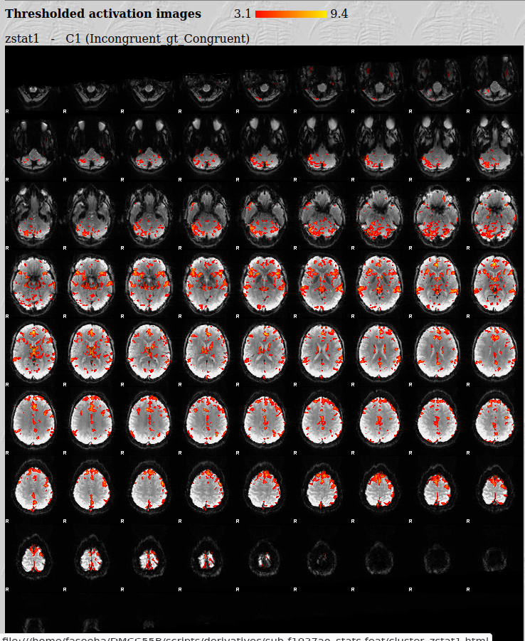
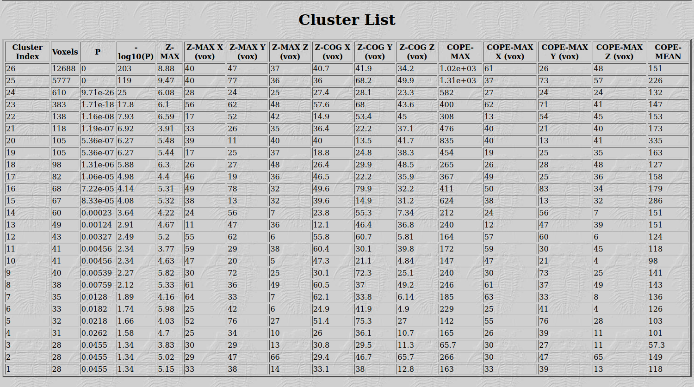
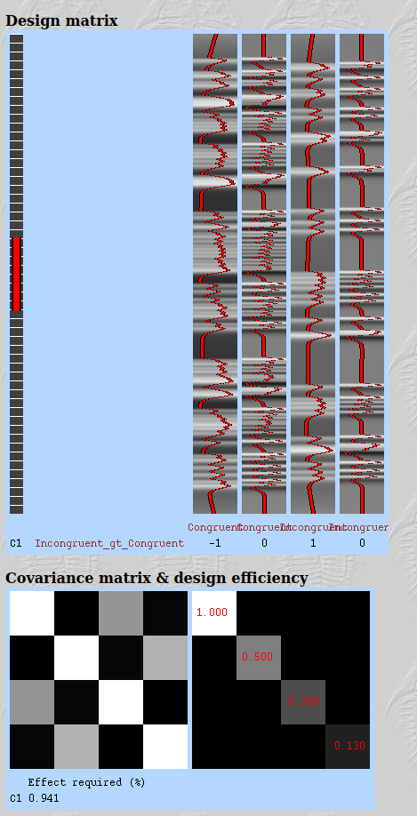
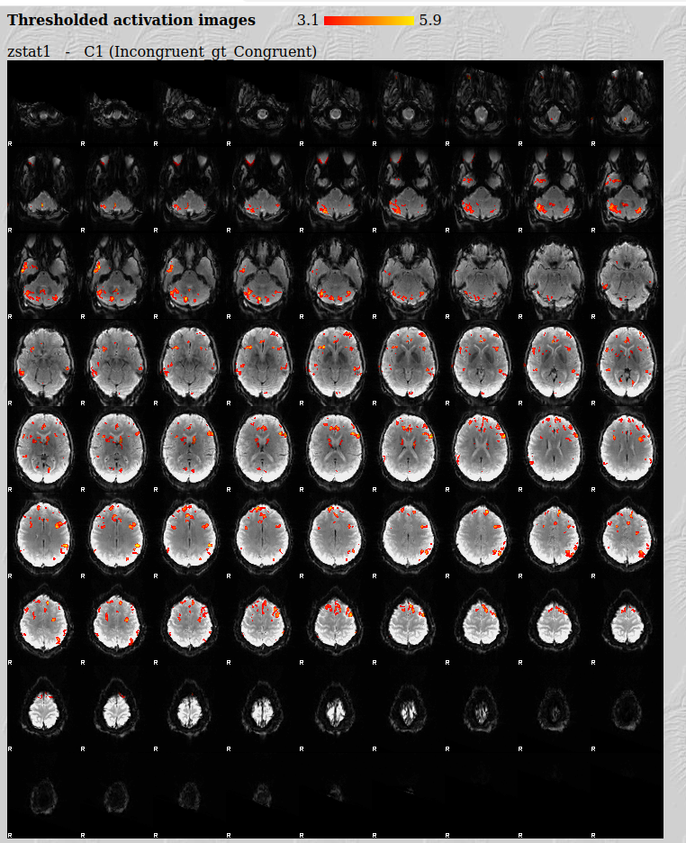
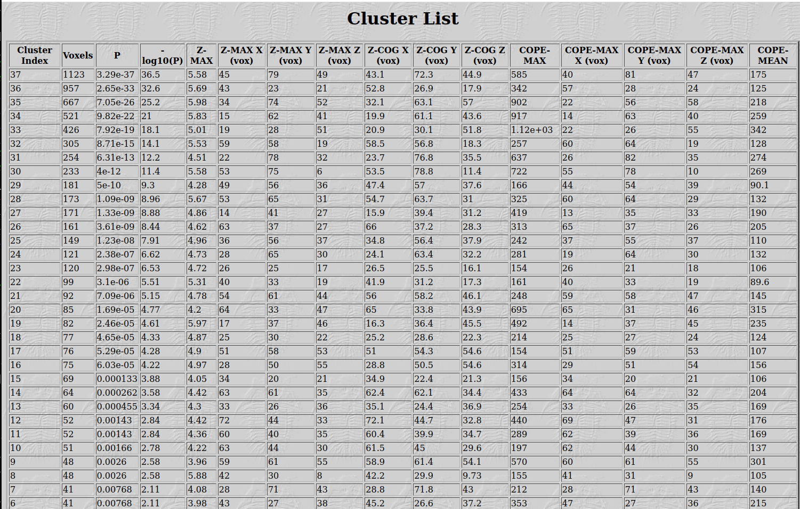
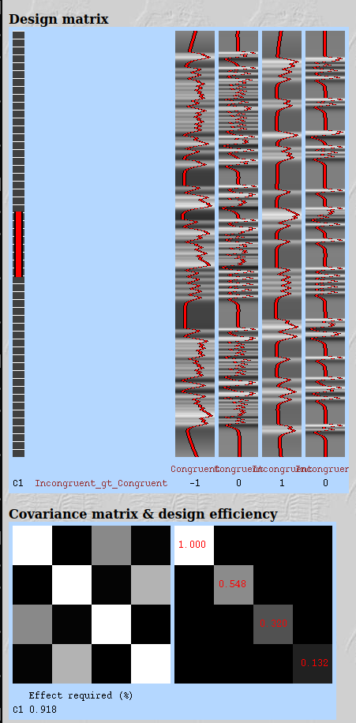
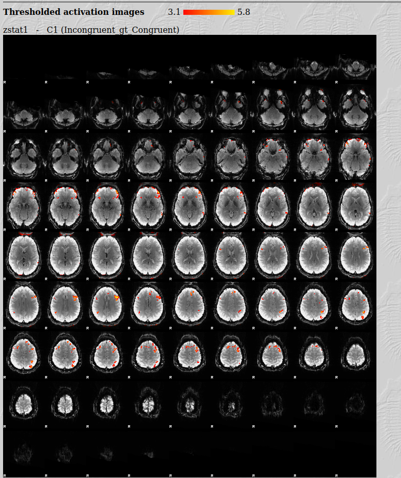
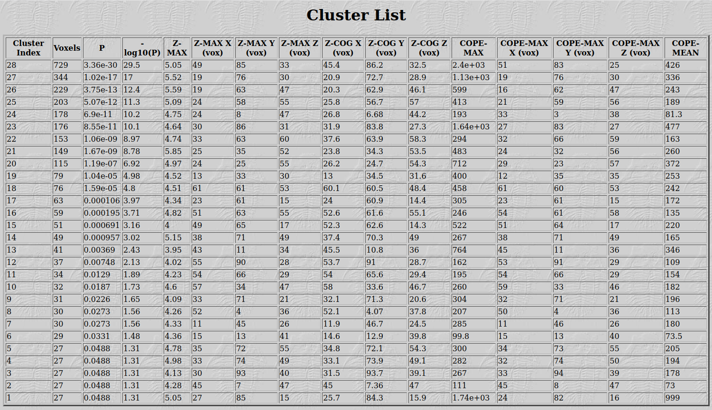
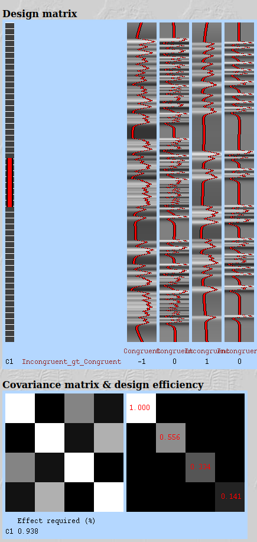

# First-Level fMRI Analysis — DMCC55B (Stroop Task)

## Overview
This project demonstrates single-subject (first-level) GLM analysis of task-based fMRI data using FSL FEAT, applied to three subjects from the DMCC55B dataset (Dual Mechanisms of Cognitive Control). Each subject's Stroop-task BOLD data was modeled to test an **Incongruent > Congruent** contrast, examining activation associated with cognitive control demands.

## Data
- **Source:** DMCC55B derivatives subset
- **Per-subject inputs used:**
  - `sub-<id>_preproc_bold.nii.gz` — preprocessed BOLD timeseries (fMRIPrep-derived)
  - `sub-<id>_brain_mask.nii.gz` — brain mask
  - `sub-<id>_confounds.tsv` — nuisance regressors
  - `sub-<id>_events.tsv` / `_congruent.txt` / `_incongruent.txt` — task timing files

## Method
- **Tool:** FSL FEAT (FMRI Expert Analysis Tool), version 6.00
- **Level:** First-level (single-subject, single-run) GLM
- **Regressors:** Congruent, Incongruent, and their temporal derivatives, convolved with a canonical HRF
- **Contrast:** C1 — Incongruent > Congruent (weights: Congruent = -1, Incongruent = 1)

## Subjects Analyzed
Three subjects were run independently through first-level FEAT to compare individual activation patterns for the same contrast.

---

### sub-f1027ao
- **Design efficiency:** 0.941
- **Top clusters (Incongruent > Congruent):**

| Cluster | Voxels | Z-max | Location (voxel coords) |
|---|---|---|---|
| 1 | 12,688 | 8.88 | (40, 47, 37) |
| 2 | 5,777 | 9.47 | (40, 77, 36) |
| 3 | 610 | 6.08 | (28, 24, 25) |

Large, strong bilateral activation — the biggest and most robust response of the three subjects, spanning frontal, parietal, and midline regions consistent with cognitive control engagement.

---

### sub-f1031ax
- **Design efficiency:** 0.918
- **Top clusters (Incongruent > Congruent):**

| Cluster | Voxels | Z-max | Location (voxel coords) |
|---|---|---|---|
| 1 | 1,123 | 5.58 | (45, 79, 49) |
| 2 | 957 | 5.69 | (43, 23, 21) |
| 3 | 667 | 5.98 | (34, 74, 52) |

More moderate activation extent than sub-f1027ao, but a similar overall spatial pattern — frontal and posterior clusters, smaller in size and peak intensity.

---

### sub-f2709ul
- **Design efficiency:** 0.938
- **Top clusters (Incongruent > Congruent):**

| Cluster | Voxels | Z-max | Location (voxel coords) |
|---|---|---|---|
| 1 | 729 | 5.05 | (49, 85, 33) |
| 2 | 344 | 5.52 | (19, 76, 30) |
| 3 | 229 | 5.59 | (19, 63, 47) |

Smallest cluster extents of the three, though peak Z-values are comparable to sub-f1031ax — illustrating natural inter-subject variability in task-related activation strength.

---

## Cross-Subject Comparison
| Subject | Design Efficiency | Largest Cluster (voxels) | Peak Z-max |
|---|---|---|---|
| sub-f1027ao | 0.941 | 12,688 | 9.47 |
| sub-f1031ax | 0.918 | 1,123 | 5.98 |
| sub-f2709ul | 0.938 | 729 | 5.59 |

All three subjects show statistically robust incongruent > congruent activation, but with clear differences in spatial extent and peak strength — a reminder that individual variability is substantial even under an identical model and contrast, which is part of why group-level analysis (when valid) is useful for identifying consistent effects.

## Why a group-level analysis wasn't performed
A higher-level (group) FLAME analysis across all 15 available subjects was attempted but is not statistically valid with this data subset. Combining subjects at the group level requires every subject's data to be in a shared spatial reference (e.g. MNI152 standard space), established via a registration transform from each subject's functional/anatomical space to that standard space.

This DMCC55B subset includes only minimally preprocessed BOLD data, brain masks, and confounds — it does **not** include anatomical (T1w) scans or any spatial normalization transforms (no `.h5` ANTs transforms, no FSL `reg/` files, no MNI-space derivatives). Checking subject cope images against the MNI152 template confirmed a dimension/resolution mismatch (81×96×81 @ 2.4mm vs. 91×109×91 @ 2mm), ruling out the possibility that the data was already in standard space. Without a genuine registration transform, there is no valid way to align subjects to a common space, so any group-level combination would be scientifically meaningless — voxel coordinates would not correspond to the same anatomical location across subjects.

**What a full pipeline would require:**
1. Each subject's anatomical (T1w) scan
2. A functional-to-anatomical registration (e.g. FSL `epi_reg`)
3. An anatomical-to-MNI152 registration/transform (e.g. FSL `fnirt`, or an fMRIPrep `.h5` transform)
4. Resampling each subject's first-level cope images into MNI space using that transform
5. Running FLAME (mixed effects) group-level analysis on the aligned copes

## Key takeaway
This project demonstrates GLM model specification, contrast setup, and result interpretation at the individual-subject level across three subjects, alongside a clear diagnostic understanding of why spatial normalization is a hard prerequisite for group-level fMRI analysis — and what a complete pipeline would need to go further.

## Tools
FSL FEAT 6.00 · bash for pipeline/file handling
